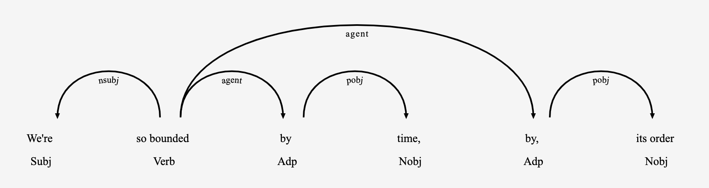

  

Compositional Generalization in Natual Language Processing. A Paper List. 

Yao Fu, University of Edinburgh, yao.fu@ed.ac.uk

----

Although seemingly trivial and being easily used everyday, our observation and knowledge of human language is restricted, biased and ultimately finite. 
Yet the variant of human language is at least exponentially large, and potentially infinite. 
How can we generalize to such large space with such limited observation? 
This is the core problem studied by compositional generalization. 

### Table of Content 

### Seminal Works
* Generalization without systematicity: On the compositional skills of sequence-to-sequence recurrent networks. Brenden M. Lake, Marco Baroni. ICML 2018

* A reproduction study of SCAN. Yao Fu. \[[code](https://github.com/FranxYao/SCAN_reproduce)\]

### Semantic Parsing 

### Question Answering

### Reading Comprehension 

### Neural-Symbolic Machines 

### Machine Learning 