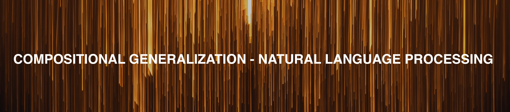

  

Compositional Generalization in Natual Language Processing. A roadmap. 

Yao Fu, University of Edinburgh, yao.fu@ed.ac.uk

If anyone interested in colaborating, please contact me. 
We aim to use this project to navigate current and future research in this area, similar to the project [DGM4NLP](https://github.com/FranxYao/Deep-Generative-Models-for-Natural-Language-Processing). 
We do not simply list papers - we aim to build up a knowledge graph/ a roadmap/ or a mind palace that knows what are the works, what are the relations between these works, what we have gone through, where we are, and where we should go. 

----

Although seemingly trivial and being easily used everyday, our observation and knowledge of human language is restricted, biased and ultimately finite. 
Yet the variant of human language is at least exponentially large, and potentially infinite. 
How can we generalize to such large space with such limited observation? 
This is the core problem studied by compositional generalization. 

* TODO: more foundations in learning theory; more semantic parsing

## Table of Content 

## Foundamentals

* Statistical Learning Theory. Percy Liang. CS229T Notes.

## NLP Side

### General 

* Evaluating Models’ Local Decision Boundaries via Contrast Sets. Matt Gardner and others, EMNLP Findings 2020. 

### Semantic Parsing 

* Generalization without systematicity: On the compositional skills of sequence-to-sequence recurrent networks. Brenden M. Lake, Marco Baroni. ICML 2018

* Improving Text-to-SQL Evaluation Methodology. Catherine Finegan-Dollak, Jonathan K. Kummerfeld, Li Zhang, Karthik Ramanathan, Sesh Sadasivam, Rui Zhang, Dragomir R. Radev

* Compositional Generalization for Neural Semantic Parsing via Span-level Supervised Attention. Pengcheng Yin, Hao Fang, Graham Neubig, Adam Pauls, Emmanouil Antonios Platanios, Yu Su, Sam Thomson, Jacob Andreas. NAACL 2021 

* Compositional generalization through meta sequence-to-sequence learning. Brenden M. Lake. NeurIPS 2019

### Datasets

* Measuring Compositional Generation: A Comprehensive Method on Realistic Data. Daniel Keysers, Nathanael Schärli, Nathan Scales, Hylke Buisman, Daniel Furrer, Sergii Kashubin, Nikola Momchev, Danila Sinopalnikov, Lukasz Stafiniak, Tibor Tihon, Dmitry Tsarkov, Xiao Wang, Marc van Zee, Olivier Bousquet. ICLR 2020

* COGS: A Compositional Generalization Challenge Based on Semantic Interpretation. Najoung Kim, Tal Linzen. EMNLP 2020

### Data Augmentation 
* Good-Enough Compositional Data Augmentation. Jacob Andreas. ACL 2020 

* Sequence-Level Mixed Sample Data Augmentation. Demi Guo, Y. Kim, Alexander M. Rush. EMNLP 2020. 

* Learning to Recombine and Resample Data for Compositional Generalization. Ekin Akyürek, Afra Feyza Akyurek, Jacob Andreas. ICLR 2021 

* Substructure Substitution: Structured Data Augmentation for NLP. Haoyue Shi, Karen Livescu, Kevin Gimpel. 2021 

* Improving Text-to-SQL Evaluation Methodology. Catherine Finegan-Dollak, Jonathan K. Kummerfeld, Li Zhang, Karthik Ramanathan, Sesh Sadasivam, Rui Zhang, Dragomir Radev. ACL 2018 

### Question Answering

* Question and Answer Test-Train Overlap in Open-Domain Question Answering Datasets. Patrick Lewis, Pontus Stenetorp, Sebastian Riedel. EACL 2020 

### Reading Comprehension 

TBC 

## ML Side 

### General 

* Measuring Compositionality in Representation Learning. Jacob Andres. ICLR 2019 

* Systematic Generalization: What Is Required and Can It Be Learned? Dzmitry Bahdanau\*, Shikhar Murty\*, Michael Noukhovitch, Thien Huu Nguyen, Harm de Vries, Aaron Courville. ICLR 2019

* Beyond I.I.D.: Three Levels of Generalization for Question Answering on Knowledge Bases. Yu Gu, Sue Kase, Michelle Vanni, Brian Sadler, Percy Liang, Xifeng Yan, Yu Su. WWW 2021

### Architectures 

* Compositional Generalization via Neural-Symbolic Stack Machines. Xinyun Chen, Chen Liang, Adams Wei Yu, Dawn Song, Denny Zhou. NeurIPS 2020 

* Learning Compositional Rules via Neural Program Synthesis. Maxwell I. Nye, Armando Solar-Lezama, Joshua B. Tenenbaum, Brenden M. Lake. NeurIPS 2020 

* Compositional Generalization by Learning Analytical Expressions. Qian Liu, Shengnan An, Jian-Guang Lou, Bei Chen, Zeqi Lin, Yan Gao, Bin Zhou, Nanning Zheng, Dongmei Zhang. NeurIPS 2020 

* Towards Complex Programs from Input-Output Examples. Xinyun Chen Chang Liu Dawn Song. ICLR 2018.

### Neural Network Learnability

* Memory-Augmented Recurrent Neural Networks Can Learn Generalized Dyck Languages. Mirac Suzgun, Sebastian Gehrmann, Yonatan Belinkov, Stuart M. Shieber.

* RNNs can generate bounded hierarchical languages with optimal memory. John Hewitt, Michael Hahn, Surya Ganguli, Percy Liang, Christopher D. Manning. EMNLP 2020

* A Formal Hierarchy of RNN Architectures. William Merrill, Gail Weiss, Yoav Goldberg, Roy Schwartz, Noah A. Smith, Eran Yahav. ACL 2020 

* Theoretical Limitations of Self-Attention in Neural Sequence Models. Michael Hahn. TACL 2019

* On the Ability and Limitations of Transformers to Recognize Formal Languages. Satwik Bhattamishra, Kabir Ahuja, Navin Goyal. EMNLP 2020

### Domain Adaptation 

* Understanding Self-Training for Gradual Domain Adaptation. Ananya Kumar, Tengyu Ma, Percy Liang. ICML 2020 

* On Learning Invariant Representation for Domain Adaptation. Han Zhao, Remi Tachet des Combes, Kun Zhang, Geoffrey J. Gordon. 2019  

### Invariance 

* Invariant Risk Minimization. 

* The Risks of Invariant Risk Minimization. Elan Rosenfeld, Pradeep Kumar Ravikumar, Andrej Risteski. ICLR 2020 

* Does Invariant Risk Minimization Capture Invariance? Pritish Kamath, Akilesh Tangella, Danica J. Sutherland, Nathan Srebro. AISTATS 2021 

### Causality
* A Meta-Transfer Objective for Learning to Disentangle Causal Mechanisms. Yoshua Bengio, Tristan Deleu, Nasim Rahaman, Rosemary Ke, Sébastien Lachapelle, Olexa Bilaniuk, Anirudh Goyal, Christopher Pal

